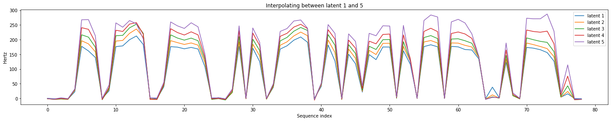

<!-- exp 1c -->

## Samples from Interpolation Examples

### Example 1

| Latent 1 | Latent 2 | Latent 3 | Latent 4 | Latent 5 | 
| --- | --- | --- | --- | --- | 
| <audio src="Experiment1/interpolation_examples/Example1/latent1.wav" controls style="width: 250px;"></audio> | <audio src="Experiment1/interpolation_examples/Example1/latent2.wav" controls style="width: 250px;"></audio> | <audio src="Experiment1/interpolation_examples/Example1/latent3.wav" controls style="width: 250px;"></audio> | <audio src="Experiment1/interpolation_examples/Example1/latent4.wav" controls style="width: 250px;"></audio> | <audio src="Experiment1/interpolation_examples/Example1/latent5.wav" controls style="width: 250px;"></audio> |

### Example 2

| Latent 1 | Latent 2 | Latent 3 | Latent 4 | Latent 5 | 
| --- | --- | --- | --- | --- | 
| <audio src="Experiment1/interpolation_examples/Example2/latent1.wav" controls style="width: 250px;"></audio> | <audio src="Experiment1/interpolation_examples/Example2/latent2.wav" controls style="width: 250px;"></audio> | <audio src="Experiment1/interpolation_examples/Example2/latent3.wav" controls style="width: 250px;"></audio> | <audio src="Experiment1/interpolation_examples/Example2/latent4.wav" controls style="width: 250px;"></audio> | <audio src="Experiment1/interpolation_examples/Example2/latent5.wav" controls style="width: 250px;"></audio> |

### Example 3

| Latent 1 | Latent 2 | Latent 3 | Latent 4 | Latent 5 | 
| --- | --- | --- | --- | --- | 
| <audio src="Experiment1/interpolation_examples/Example3/latent1.wav" controls style="width: 250px;"></audio> | <audio src="Experiment1/interpolation_examples/Example3/latent2.wav" controls style="width: 250px;"></audio> | <audio src="Experiment1/interpolation_examples/Example3/latent3.wav" controls style="width: 250px;"></audio> | <audio src="Experiment1/interpolation_examples/Example3/latent4.wav" controls style="width: 250px;"></audio> | <audio src="Experiment1/interpolation_examples/Example3/latent5.wav" controls style="width: 250px;"></audio> |

### Example 4

| Latent 1 | Latent 2 | Latent 3 | Latent 4 | Latent 5 | 
| --- | --- | --- | --- | --- | 
| <audio src="Experiment1/interpolation_examples/Example4/latent1.wav" controls style="width: 250px;"></audio> | <audio src="Experiment1/interpolation_examples/Example4/latent2.wav" controls style="width: 250px;"></audio> | <audio src="Experiment1/interpolation_examples/Example4/latent3.wav" controls style="width: 250px;"></audio> | <audio src="Experiment1/interpolation_examples/Example4/latent4.wav" controls style="width: 250px;"></audio> | <audio src="Experiment1/interpolation_examples/Example4/latent5.wav" controls style="width: 250px;"></audio> |

  
Back to [Experiment 1](https://ljlj9.github.io/mscproject/experiment_1.html).
  
Navigate to Home page [here](https://ljlj9.github.io/mscproject/index.html).