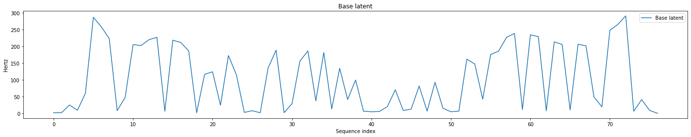

<!-- exp 1d -->

## Samples from Transfer Examples

### Example 1

 

Base Latent
 
<audio src="Experiment1/transfer_examples/Example2/base_latent.wav" controls style="width: 250px;"></audio>
 

 
Before
 
<audio src="Experiment1/transfer_examples/Example2/transfer_before.wav" controls style="width: 250px;"></audio>
 
After
 
<audio src="Experiment1/transfer_examples/Example2/transfer_after.wav" controls style="width: 250px;"></audio>

### Example 2

 

Base Latent
 
<audio src="Experiment1/transfer_examples/Example3/base_latent.wav" controls style="width: 250px;"></audio>
 

 
Before
 
<audio src="Experiment1/transfer_examples/Example3/transfer_before.wav" controls style="width: 250px;"></audio>
 
After
 
<audio src="Experiment1/transfer_examples/Example3/transfer_after.wav" controls style="width: 250px;"></audio>

  
Back to [Experiment 1](https://ljlj9.github.io/mscproject/experiment_1.html).
  
Navigate to Home page [here](https://ljlj9.github.io/mscproject/index.html).
